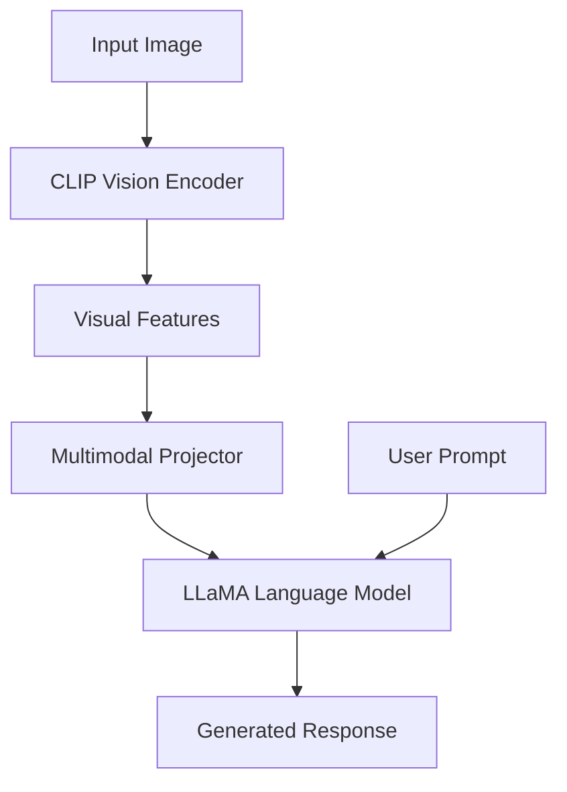
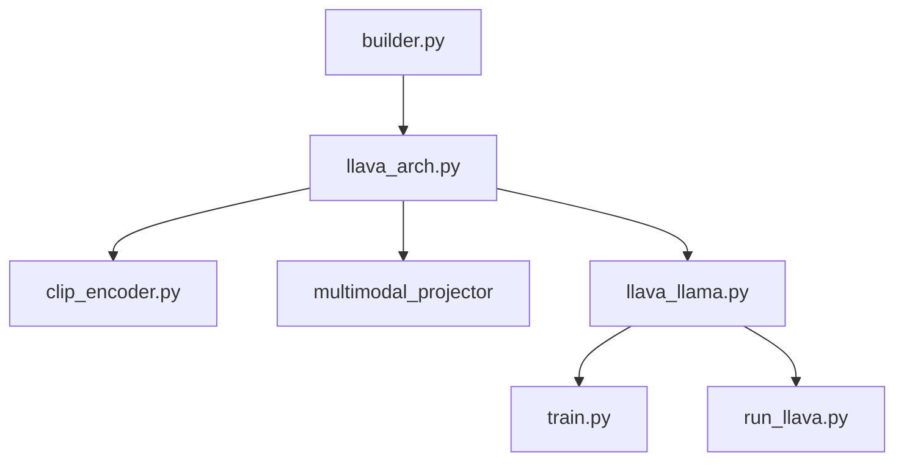

# LLaVA Implementation Study


A comprehensive implementation study of the **official LLaVA (Large Language and Vision Assistant)** repository.

This repository documents the architecture, implementation, training pipeline, and inference workflow of LLaVA by analyzing the official source code module by module.

> **Note**
>
> This repository is an educational implementation study. The original implementation belongs to the official LLaVA authors.

---

# Repository Overview

Large Vision-Language Models combine computer vision with large language models to solve multimodal tasks such as:

- Visual Question Answering
- Image Captioning
- OCR-based reasoning
- Document Understanding
- General Visual Chat

This repository explains **how the official LLaVA implementation works internally**, beginning from model loading and ending with complete multimodal inference.

---

# Architecture Overview



---

# Documentation Roadmap

## Fundamentals

| Document | Description |
|-----------|-------------|
| [01_Vision_Language_Models.md](docs/01_Vision_Language_Models.md) | Introduction to Vision-Language Models |
| [02_LLaVA_Architecture.md](docs/02_LLaVA_Architecture.md) | Complete LLaVA architecture |
| [03_Repository_Structure.md](docs/03_Repository_Structure.md) | Repository organization |

---

## Core Implementation

| Document | Description |
|-----------|-------------|
| [04_Model_Loading.md](docs/04_Model_Loading.md) | builder.py |
| [05_llava_arch.md](docs/05_llava_arch.md) | Multimodal architecture |
| [06_clip_encoder.md](docs/06_clip_encoder.md) | CLIP Vision Encoder |
| [07_multimodal_projector.md](docs/07_multimodal_projector.md) | Feature alignment |
| [08_llava_llama.md](docs/08_llava_llama.md) | LLaMA integration |

---

## Utilities

| Document | Description |
|-----------|-------------|
| [09_conversation.md](docs/09_conversation.md) | Prompt templates |
| [10_mm_utils.md](docs/10_mm_utils.md) | Utility functions |

---

## Training

| Document | Description |
|-----------|-------------|
| [11_train.md](docs/11_train.md) | Training entry point |
| [12_llava_trainer.md](docs/12_llava_trainer.md) | Training engine |
| [14_training_pipeline.md](docs/14_training_pipeline.md) | End-to-end training |

---

## Inference

| Document | Description |
|-----------|-------------|
| [13_run_llava.md](docs/13_run_llava.md) | Inference script |
| [15_inference_pipeline.md](docs/15_inference_pipeline.md) | End-to-end inference |

---

# Repository Structure

```
LLaVA-Implementation-Study/

├── docs/
│   ├── 01_Vision_Language_Models.md
│   ├── 02_LLaVA_Architecture.md
│   ├── ...
│   └── 15_inference_pipeline.md
│
├── diagrams/
│
├── references/
│
├── README.md
├── LICENSE
└── .gitignore
```

---

# Learning Outcomes

After completing this study, readers should understand:

- Vision-Language Model architecture
- CLIP Vision Transformer
- LLaMA integration
- Multimodal feature projection
- Image embedding generation
- Prompt construction
- Training workflow
- Inference workflow
- Repository organization
- Code flow across modules

---

# Module Dependency



---

# Technologies

- Python
- PyTorch
- Hugging Face Transformers
- CLIP
- LLaMA
- Vision Transformers

---

# References

- Official LLaVA Repository
- LLaVA Paper
- CLIP Paper
- LLaMA Paper
- Hugging Face Transformers Documentation

---

# License

This repository is released under the MIT License.

---

# Acknowledgements

Special thanks to the authors of the official **LLaVA** project for making their implementation publicly available for learning and research.