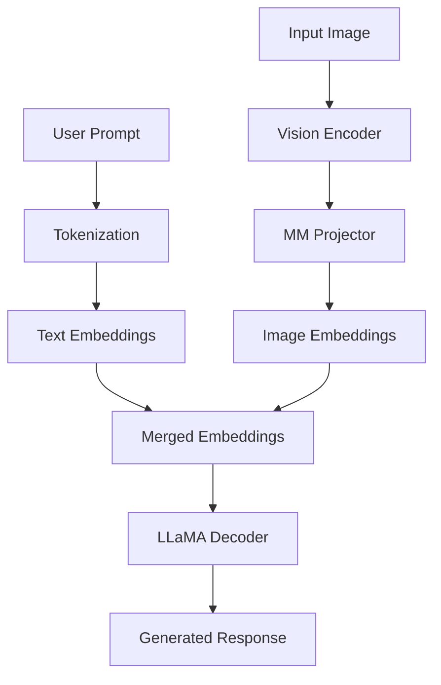

# LLaVA Architecture (`llava_arch.py`)

## Introduction

The `llava_arch.py` file contains the core multimodal architecture of LLaVA. It is responsible for connecting the vision encoder with the language model and preparing image features so they can be processed together with text.

Unlike `builder.py`, which only loads the model components, `llava_arch.py` defines how these components interact during inference and training.

This file is the heart of the entire LLaVA implementation.

---

# Responsibilities

The major responsibilities of this file include:

- Initializing vision modules
- Loading the multimodal projector
- Encoding images
- Projecting visual features
- Preparing multimodal inputs
- Replacing image tokens with image embeddings

---

# Overall Pipeline

```
                Image
                  │
                  ▼
        CLIP Vision Encoder
                  │
          Image Features
                  │
                  ▼
      Multimodal Projector
                  │
        Image Embeddings
                  │
                  ▼
prepare_inputs_labels_for_multimodal()
                  │
                  ▼
Replace <image> Token
                  │
                  ▼
      LLaMA Forward Pass
```

---

# Main Classes

The file mainly defines two classes.

```
LlavaMetaModel

LlavaMetaForCausalLM
```

These classes extend the Hugging Face LLaMA implementation with multimodal capabilities.

---

---

# Key Functions

The following functions implement the core multimodal logic of LLaVA.

| Function | Purpose |
|----------|---------|
| `initialize_vision_modules()` | Initializes the Vision Tower and MM Projector |
| `get_vision_tower()` | Returns the loaded Vision Tower |
| `encode_images()` | Converts images into projected visual embeddings |
| `prepare_inputs_labels_for_multimodal()` | Merges image embeddings with text embeddings |

These functions work together to bridge the gap between the vision encoder and the language model.

---

# LlavaMetaModel

This class is responsible for constructing the vision-related components.

Its major functions include:

- build_vision_tower()
- build_vision_projector()

Instead of hardcoding the vision encoder or projector, these components are created dynamically based on the configuration.

---

# initialize_vision_modules()

This function initializes all vision-related modules.

It performs tasks such as:

- Building the Vision Tower
- Building the Multimodal Projector
- Loading pretrained projector weights (if available)
- Configuring projector type

After this function completes, the model is ready to process images.

---

# get_vision_tower()

Instead of accessing the vision encoder directly throughout the codebase, this helper function returns the initialized Vision Tower.

This simplifies the implementation and avoids duplicate code.

---

# encode_images()

This function performs the first stage of multimodal processing.

Pipeline:

```
Images

↓

Vision Tower

↓

Visual Features

↓

MM Projector

↓

Projected Image Embeddings
```

The output is no longer in the CLIP embedding space—it has already been projected into the LLaMA embedding space.

---

---

# Simplified Implementation

The implementation follows the sequence below:

```python
vision_tower = self.get_vision_tower()

image_features = vision_tower(images)

image_features = self.mm_projector(image_features)

return image_features
```

### Step-by-step explanation

1. The Vision Tower extracts patch-level visual features from the input image.
2. These features are still in the CLIP embedding space.
3. The Multimodal Projector transforms them into the LLaMA embedding space.
4. The projected embeddings are returned for multimodal processing.

> **Note:** This is a simplified representation for educational purposes. The official implementation includes additional handling for feature selection, batching, and configuration.

# Why Projection Is Necessary

The Vision Tower and LLaMA use different embedding dimensions.

Example:

```
CLIP

(576 × 1024)

↓

MM Projector

↓

(576 × 4096)
```

Without this transformation, the language model cannot consume visual features.

---

# prepare_inputs_labels_for_multimodal()

This is the most important function in the file.

Its job is to combine image information with text before the forward pass.

At a high level, it performs the following steps:

1. Detect image tokens in the prompt.
2. Encode images.
3. Project visual features.
4. Replace `<image>` token embeddings with projected image embeddings.
5. Construct the final embedding sequence.
6. Return embeddings and labels to the language model.

---

---

# Simplified Logic

The overall logic can be summarized as:

```python
image_features = self.encode_images(images)

inputs_embeds = self.get_model().embed_tokens(input_ids)

replace_image_tokens_with_embeddings()

return inputs_embeds
```

The actual implementation performs additional operations such as:

- Padding
- Attention mask creation
- Label alignment
- Position ID generation
- Batch processing

However, the fundamental idea remains the same: replace the `<image>` placeholder with projected image embeddings before passing the sequence to LLaMA.

# Embedding Replacement

User Prompt:

```
<image>

Describe the image.
```

Tokenizer Output:

```
[IMAGE_TOKEN]

Describe

the

image

.
```

After processing:

```
Image Embeddings

Describe

the

image

.
```

The `<image>` placeholder no longer exists.

It has been replaced by hundreds of learned visual embeddings.

---

# Why Replace Instead of Append?

Replacing the placeholder token allows the language model to process visual information exactly like text embeddings.

No changes are required to the transformer architecture.

This design keeps LLaVA simple while leveraging the existing capabilities of LLaMA.

---

# Data Flow


---

# Interaction with Other Files

```
builder.py

↓

llava_arch.py

↓

clip_encoder.py

↓

multimodal_projector/

↓

llava_llama.py
```

This file acts as the bridge between the vision encoder and the language model.

---

---

# Code Flow

The execution order during inference is:

```
run_llava.py
      │
      ▼
load_pretrained_model()
      │
      ▼
prepare_inputs_labels_for_multimodal()
      │
      ▼
encode_images()
      │
      ▼
Vision Tower
      │
      ▼
MM Projector
      │
      ▼
LLaMA Forward Pass
      │
      ▼
Generated Response
```

This flow illustrates how `llava_arch.py` coordinates the interaction between the vision encoder and the language model.

# Summary

`llava_arch.py` is the core implementation of LLaVA.

It initializes the vision modules, converts images into language-model-compatible embeddings, replaces image tokens with projected visual embeddings, and prepares the final multimodal input passed to LLaMA.

Without this file, LLaVA would behave like a standard text-only language model.

---

# Next

The next document explains the implementation of the CLIP Vision Encoder (`clip_encoder.py`) and how images are converted into visual feature representations.