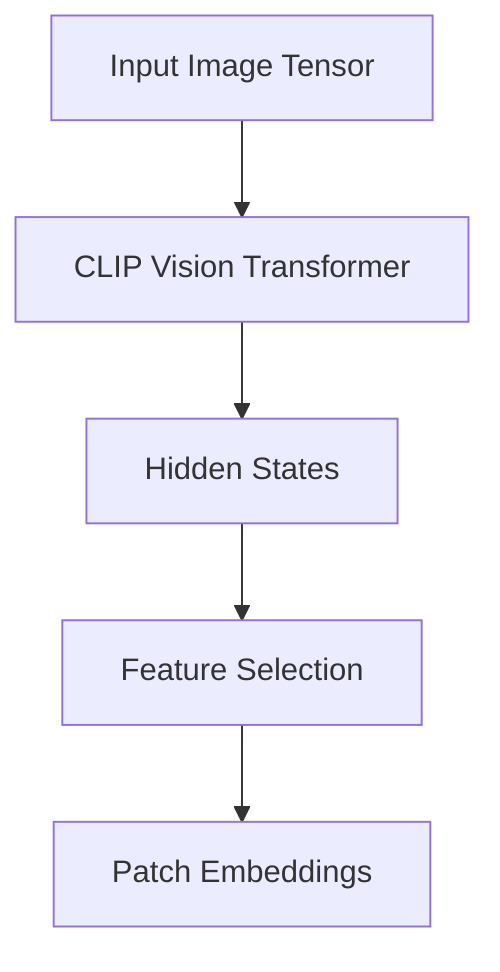
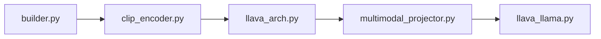

# CLIP Vision Encoder (`clip_encoder.py`)

## Introduction

The `clip_encoder.py` file implements the Vision Tower used by LLaVA. Its primary responsibility is to load a pretrained CLIP Vision Transformer and convert input images into high-dimensional visual feature representations.

Unlike traditional image classification models, the CLIP Vision Encoder does not produce class labels. Instead, it generates feature embeddings that capture the semantic content of an image. These embeddings are later projected into the LLaMA embedding space using the Multimodal Projector.

---

# Position in the Pipeline

```
Image
 │
 ▼
Image Processor
 │
 ▼
CLIP Vision Encoder
 │
 ▼
Visual Features
 │
 ▼
Multimodal Projector
 │
 ▼
LLaMA
```

This file is responsible only for the highlighted stage: converting images into visual features.

---

# Main Class

The primary class defined in this file is:

```python
CLIPVisionTower
```

This class acts as a wrapper around Hugging Face's `CLIPVisionModel`.

Its responsibilities include:

- Loading the pretrained vision model
- Loading the image processor
- Encoding images
- Returning hidden-state features

---

---

# Key Functions

The `CLIPVisionTower` class provides a simple interface for loading and using the pretrained CLIP Vision Transformer.

| Function | Purpose |
|----------|---------|
| `load_model()` | Loads the pretrained CLIP Vision Model and Image Processor |
| `feature_select()` | Selects hidden states from the desired transformer layer |
| `forward()` | Generates visual features from input images |
| `dummy_feature()` | Returns a placeholder feature tensor when needed |

Together, these functions manage the complete visual feature extraction pipeline.

---

# Initialization

When the Vision Tower is created, it performs the following steps:

```
Configuration
      │
      ▼
Load CLIPVisionModel
      │
      ▼
Load CLIPImageProcessor
      │
      ▼
Store Model Configuration
```

The actual model weights are loaded only once and reused throughout inference.

---

---

# Simplified Model Loading

The initialization process can be summarized as:

```python
self.image_processor = CLIPImageProcessor.from_pretrained(model_name)

self.vision_tower = CLIPVisionModel.from_pretrained(model_name)

self.vision_tower.requires_grad_(False)
```

### Explanation

1. Load the image preprocessing pipeline.
2. Load the pretrained CLIP Vision Transformer.
3. Freeze model parameters during inference.

> **Note:** The official implementation contains additional configuration handling and delayed loading options. The snippet above is simplified for educational purposes.

---

# Image Processing

Before an image reaches the Vision Transformer, it must be preprocessed.

Typical preprocessing steps include:

- Resize
- Center Crop
- Normalize
- Convert to Tensor

These operations are handled by the CLIP Image Processor.

---

# Forward Pass

The forward pass converts an image tensor into patch-level feature embeddings.

### Simplified Implementation

```python
image_forward_out = self.vision_tower(images)

image_features = self.feature_select(image_forward_out)

return image_features
```

### Execution Flow



The Vision Transformer produces hidden states for every transformer layer, after which the desired layer is selected as the visual representation.

---

# Patch Embeddings

The Vision Transformer divides an image into fixed-size patches.

For example:

```
336 × 336 Image

↓

24 × 24 patches

↓

576 Patch Tokens
```

Each patch is represented by a feature vector.

Typical output shape:

```
(B, 576, 1024)
```

where:

- **B** = Batch Size
- **576** = Number of image patches
- **1024** = Feature dimension

---

# Feature Selection

The Vision Transformer generates hidden states from every encoder layer.

Instead of always using the final layer, LLaVA allows selecting features from a configurable layer.

### Simplified Logic

```python
image_features = image_forward_out.hidden_states[layer_index]
```

Depending on the configuration, the implementation may:

- Use the last hidden layer
- Use an intermediate hidden layer
- Remove the CLS token
- Keep only patch embeddings

This flexibility allows experimentation with different visual representations while using the same pretrained CLIP model.

---

# Why Hidden States?

Using hidden states instead of classification outputs preserves detailed spatial information.

Each token corresponds to a specific image region, allowing the language model to reason about different parts of the image.

---

# Lazy Loading

To reduce memory usage, the Vision Tower supports delayed model loading.

Instead of immediately loading the large CLIP model during object creation, the implementation can postpone loading until the model is actually needed.

Advantages include:

- Faster startup
- Lower memory consumption
- Flexible distributed training

---

# Interaction with Other Files


---

---

# Code Flow

During inference, the execution sequence is:

```
Load Image

↓

process_images()

↓

CLIPImageProcessor

↓

CLIPVisionTower.forward()

↓

feature_select()

↓

Visual Features

↓

Multimodal Projector
```

The output of this file becomes the input to the Multimodal Projector, where feature alignment with the LLaMA embedding space begins.

# Summary

The `clip_encoder.py` file wraps the pretrained CLIP Vision Transformer and provides a clean interface for image encoding.

Its responsibilities include:

- Loading the CLIP Vision Model
- Preprocessing images
- Producing visual feature embeddings
- Returning patch-level representations

The generated features are then passed to the Multimodal Projector for alignment with the LLaMA embedding space.

---

# Next

The next document explains the Multimodal Projector (`multimodal_projector/builder.py`), which transforms CLIP feature vectors into embeddings compatible with the LLaMA language model.