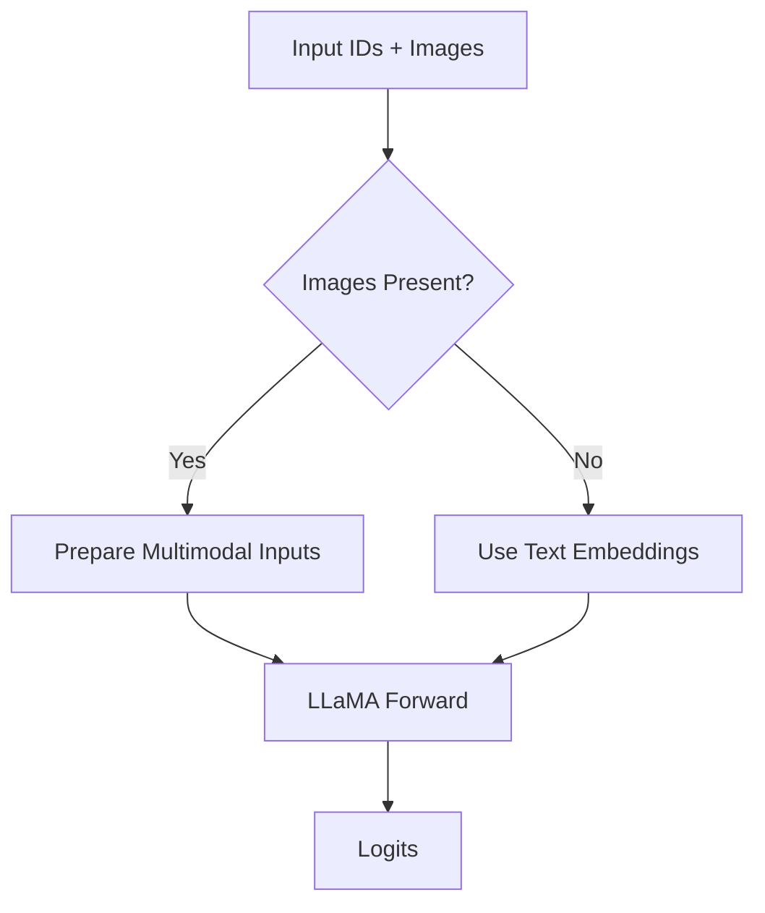
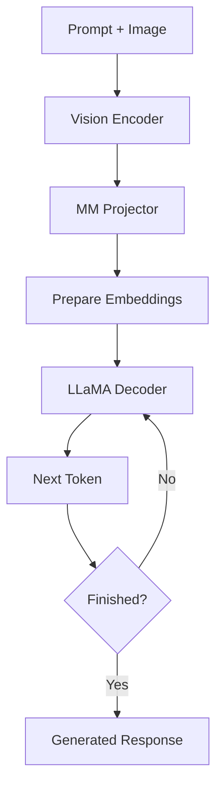
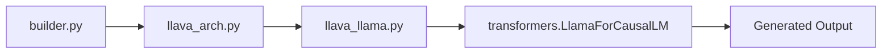

# LLaVA Language Model (`llava_llama.py`)

## Introduction

The `llava_llama.py` file integrates the multimodal capabilities of LLaVA with the LLaMA language model. While `llava_arch.py` prepares multimodal embeddings, this file is responsible for executing the forward pass and text generation.

It extends Hugging Face's `LlamaForCausalLM` and enables LLaMA to process both textual and visual information without modifying the transformer architecture.

---

# Position in the Pipeline

```
Image
 │
 ▼
Vision Encoder
 │
 ▼
Multimodal Projector
 │
 ▼
Image Embeddings
 │
 ▼
prepare_inputs_labels_for_multimodal()
 │
 ▼
LLaMA
 │
 ▼
Generated Response
```

---

# Main Class

The primary class is:

```python
LlavaLlamaForCausalLM
```

It inherits from Hugging Face's `LlamaForCausalLM` and adds multimodal support.

---

---

# Key Functions

The `LlavaLlamaForCausalLM` class extends the standard Hugging Face implementation by introducing multimodal capabilities.

| Function | Purpose |
|----------|---------|
| `forward()` | Performs a multimodal forward pass |
| `generate()` | Generates responses during inference |
| `prepare_inputs_labels_for_multimodal()` | Builds multimodal embeddings before decoding |
| `get_model()` | Returns the underlying LLaMA model |

These functions allow LLaVA to process both text and images while preserving the original LLaMA architecture.

---

# Inheritance Structure

```
LlamaForCausalLM
        ▲
        │
LlavaLlamaForCausalLM
```

Instead of rewriting the language model, LLaVA extends it with additional multimodal functionality.

---

# Model Construction

During initialization, the class creates:

- LLaMA Decoder
- Language Modeling Head
- Multimodal Architecture

Internally, it contains an instance of `LlavaMetaModel`, which provides the vision encoder and multimodal projector.

```
LlavaLlamaForCausalLM
        │
        ▼
LlavaMetaModel
        │
        ├── Vision Tower
        ├── MM Projector
        └── LLaMA
```

---

---

# Simplified Initialization

The overall initialization process can be summarized as:

```python
self.model = LlavaMetaModel(config)

self.lm_head = nn.Linear(
    config.hidden_size,
    config.vocab_size,
    bias=False
)
```

### Explanation

1. Construct the multimodal LLaVA model.
2. Initialize the language modeling head.
3. Reuse the pretrained LLaMA transformer layers.

> **Note:** The official implementation contains additional configuration logic and compatibility handling. The snippet above highlights the core construction process.

---

# Forward Pass

The forward method first checks whether images are present.

### Simplified Implementation

```python
if images is not None:

    inputs_embeds = self.prepare_inputs_labels_for_multimodal(...)

return super().forward(
    inputs_embeds=inputs_embeds,
    labels=labels
)
```

### Execution Flow



If an image is provided, multimodal embeddings are constructed before calling the underlying LLaMA implementation.

---

# Preparing Inputs

Before calling the language model, the implementation invokes:

```python
prepare_inputs_labels_for_multimodal()
```

This function:

- Encodes images
- Projects visual features
- Replaces `<image>` tokens
- Builds the final embedding sequence

The resulting embeddings are then passed to the LLaMA decoder.

---

# Text Generation

Inference relies on Hugging Face's generation framework.

### Simplified Implementation

```python
output_ids = model.generate(

    input_ids,

    images=images,

    max_new_tokens=512,

    temperature=0.2
)
```

Internally, generation follows this sequence:



The decoder repeatedly predicts the next token until an end-of-sequence token or the maximum generation length is reached.

---

# Generation Parameters

Common parameters include:

- `temperature`
- `top_p`
- `num_beams`
- `max_new_tokens`
- `use_cache`

These control randomness, search strategy, and generation length without changing the underlying model.

---

# Why Extend Instead of Rewrite?

By inheriting from `LlamaForCausalLM`, LLaVA can reuse:

- Optimized transformer implementation
- Hugging Face generation utilities
- Tokenization pipeline
- Caching mechanism
- Training utilities

Only the multimodal components need to be added.

---



---

---

# Code Flow

The execution sequence during inference is:

```
run_llava.py

↓

load_pretrained_model()

↓

prepare_inputs_labels_for_multimodal()

↓

forward()

↓

LLaMA Decoder

↓

generate()

↓

Decode Tokens

↓

Final Response
```

The `llava_llama.py` file is the final stage before text generation, combining multimodal embeddings with the autoregressive decoder inherited from LLaMA.

---

# Why This Design?

Instead of modifying the internal transformer layers, LLaVA extends the existing `LlamaForCausalLM` implementation.

This design offers several advantages:

- Reuses Hugging Face's optimized transformer implementation.
- Maintains compatibility with existing checkpoints.
- Simplifies future upgrades to newer LLaMA versions.
- Keeps multimodal logic separate from language modeling logic.

By following an inheritance-based design, LLaVA introduces multimodal capabilities with minimal changes to the underlying language model.

---


# Summary

The `llava_llama.py` file extends the pretrained LLaMA model with multimodal capabilities. It prepares image-text embeddings, performs the forward pass, and generates responses using Hugging Face's standard generation framework.

Rather than modifying the transformer architecture, it leverages inheritance to integrate visual information while preserving the original language model implementation.

---

# Next

The next document explores `conversation.py`, which defines conversation templates, prompt formatting, and the structure of user-assistant interactions before tokenization.