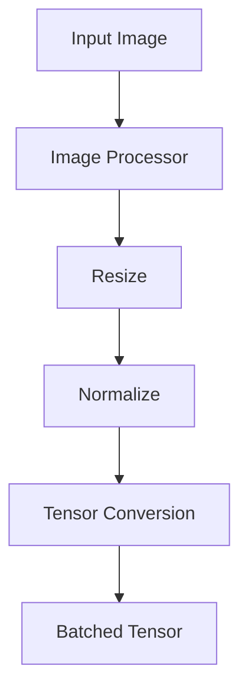
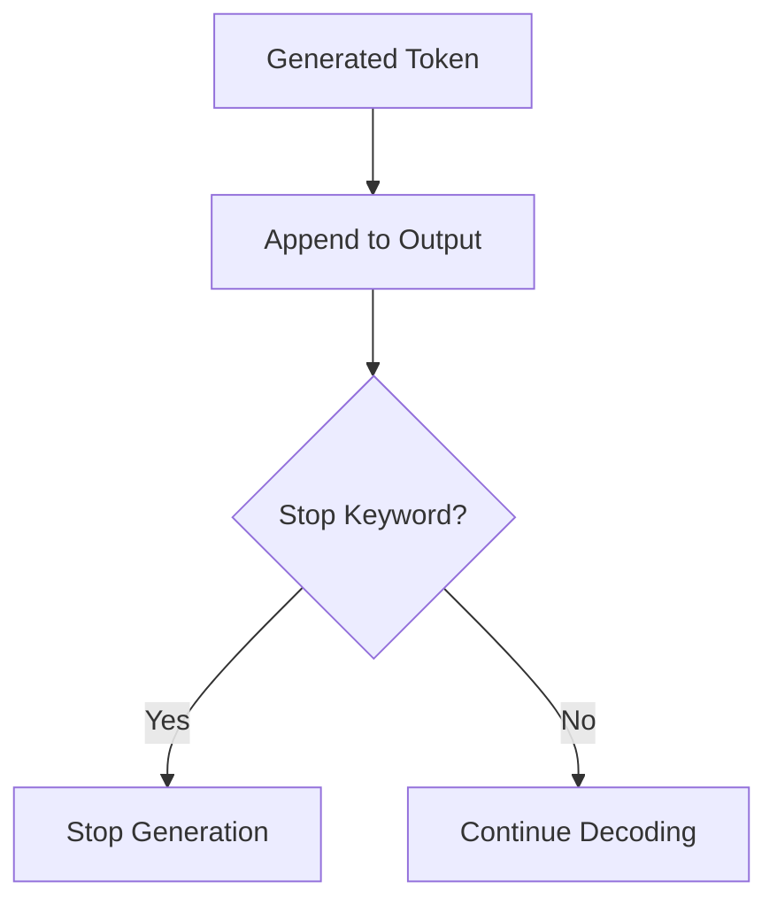

# Multimodal Utilities (`mm_utils.py`)

## Introduction

The `mm_utils.py` file contains a collection of utility functions that simplify multimodal processing in LLaVA. Rather than implementing common operations repeatedly across different modules, these helper functions centralize tasks such as image preprocessing, image token handling, prompt processing, and model utilities.

Although this file does not implement the model itself, it plays a critical role in connecting the vision and language components during inference.

---

# Position in the Pipeline

```
User Input
      │
      ▼
conversation.py
      │
      ▼
mm_utils.py
      │
      ├── Process Images
      ├── Insert Image Tokens
      ├── Tokenize Prompt
      └── Prepare Inputs
      │
      ▼
LLaVA Model
```

---

# Responsibilities

The major responsibilities of this file include:

- Image preprocessing
- Image token insertion
- Prompt tokenization
- Utility functions for inference
- Model name extraction
- Stopping criteria for generation

---

---

# Key Functions

The `mm_utils.py` file contains reusable helper functions used throughout the LLaVA repository.

| Function | Purpose |
|----------|---------|
| `process_images()` | Converts raw images into tensors |
| `tokenizer_image_token()` | Inserts special image tokens into prompts |
| `get_model_name_from_path()` | Extracts the model name from a checkpoint path |
| `KeywordsStoppingCriteria` | Stops generation when predefined keywords are produced |

These utilities simplify image preprocessing and prompt handling across both training and inference.

---

# Image Processing

Images received from the user must be converted into tensors before they can be passed to the Vision Encoder.

Typical workflow:

```
Image
   │
   ▼
Resize
   │
   ▼
Normalize
   │
   ▼
Convert to Tensor
   │
   ▼
Batch Images
```

The resulting tensor is compatible with the CLIP Vision Encoder.

---

# process_images()

This helper converts one or more user images into tensors compatible with the Vision Encoder.

### Simplified Implementation

```python
image_tensors = image_processor(

    images,

    return_tensors="pt"

)["pixel_values"]

return image_tensors
```

### Execution Flow



The returned tensor is directly passed to the CLIP Vision Encoder.

---

# tokenizer_image_token()

The tokenizer must preserve the `<image>` placeholder while converting text into token IDs.

### Simplified Implementation

```python
prompt = prompt.replace(

    "<image>",

    DEFAULT_IMAGE_TOKEN
)

input_ids = tokenizer(prompt).input_ids
```

The `<image>` placeholder is **not** removed during tokenization.

Instead, it is preserved so that `prepare_inputs_labels_for_multimodal()` can later replace it with projected image embeddings.


---

# get_model_name_from_path()

This helper extracts the model name from a checkpoint path.

Example:

```
checkpoints/llava-v1.5-7b

↓

llava-v1.5-7b
```

This simplifies configuration and logging across the repository.

---

# KeywordsStoppingCriteria

During autoregressive generation, the model should stop once a predefined separator or keyword has been generated.

### Simplified Logic

```python
if generated_text.endswith(stop_keyword):

    return True
```

Execution flow:



This prevents the model from generating unnecessary text after completing the assistant's response.

---

# Why Centralize Utilities?

Without `mm_utils.py`, identical preprocessing logic would need to be duplicated across multiple files.

Centralizing these operations provides several benefits:

- Cleaner code
- Better maintainability
- Consistent preprocessing
- Easier debugging
- Reusable helper functions

---

# Interaction with Other Files


---

---

# Code Flow

The helper functions are used throughout the inference pipeline.

```
User Image

↓

process_images()

↓

Image Tensor

↓

Vision Encoder

↓

tokenizer_image_token()

↓

Input IDs

↓

prepare_inputs_labels_for_multimodal()

↓

Generation
```

Although `mm_utils.py` does not implement any neural network components, it provides essential preprocessing utilities that connect user input with the multimodal model.

---


# Summary

The `mm_utils.py` file provides reusable helper functions that support multimodal inference in LLaVA. It handles image preprocessing, image token insertion, prompt tokenization, model utilities, and generation stopping logic.

Although it does not implement any neural network components, it serves as an essential bridge between user input and the multimodal architecture.

---

# Next

The next document explores `train.py`, the main training entry point responsible for dataset loading, model initialization, distributed training configuration, and launching the LLaVA training pipeline.