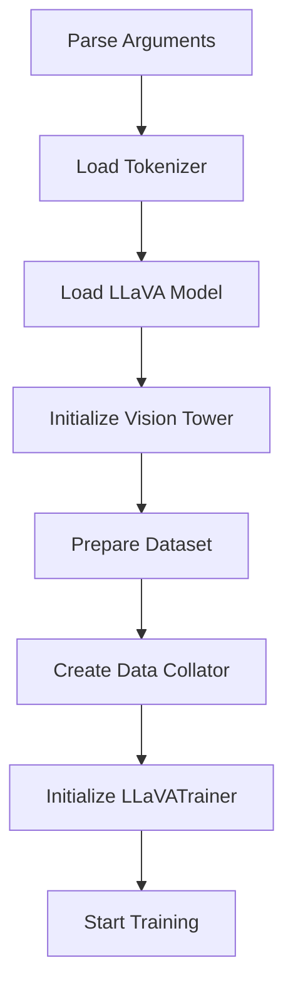
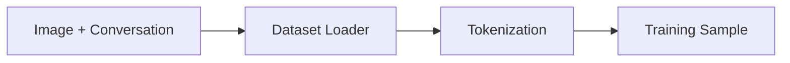
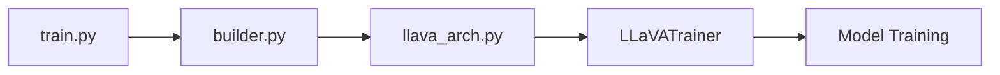

# Training Entry Point (`train.py`)

## Introduction

The `train.py` file is the primary entry point for training LLaVA. It is responsible for parsing training arguments, loading the pretrained model, preparing datasets, configuring the tokenizer, initializing the trainer, and launching the complete training process.

Rather than implementing optimization algorithms itself, this file orchestrates the entire training workflow by connecting all major components of the repository.

---

# Position in the Training Pipeline

```
Training Command
        │
        ▼
train.py
        │
        ├── Parse Arguments
        ├── Load Model
        ├── Load Tokenizer
        ├── Prepare Dataset
        ├── Initialize Trainer
        └── Start Training
```

This file serves as the controller for the training process.

---

---

# Key Functions

The `train.py` file coordinates the complete training workflow by initializing all required components.

| Function | Purpose |
|----------|---------|
| `train()` | Main entry point for training |
| `make_supervised_data_module()` | Creates the dataset and data collator |
| `safe_save_model_for_hf_trainer()` | Safely saves model checkpoints |
| `smart_tokenizer_and_embedding_resize()` | Updates tokenizer and embedding layers when adding special tokens |

These functions work together to prepare data, configure the model, and launch training.

---

# Training Workflow

The training process follows the sequence below.



Each stage prepares the next component until the complete training pipeline is ready.

---

# Argument Parsing

Training begins by reading command-line arguments.

These arguments define:

- Model path
- Dataset path
- Batch size
- Learning rate
- Number of epochs
- Output directory
- Precision (FP16/BF16)
- Distributed training settings

This design allows experiments to be configured without modifying the source code.

---

---

# Simplified Training Entry

The overall training process begins with:

```python
def train():

    model = load_pretrained_model(...)

    tokenizer = AutoTokenizer.from_pretrained(...)

    data_module = make_supervised_data_module(...)

    trainer = LLaVATrainer(...)

    trainer.train()
```

### Explanation

1. Load the pretrained model.
2. Initialize the tokenizer.
3. Prepare the training dataset.
4. Create the trainer.
5. Start optimization.

> **Note:** The official implementation supports many additional configuration options such as DeepSpeed, LoRA, quantization, and distributed training. The snippet above focuses on the core workflow.

---

# Loading the Model

The pretrained LLaVA model is loaded first.

This step initializes:

```
Tokenizer

↓

LLaMA

↓

Vision Tower

↓

Multimodal Projector
```

The model is then moved to the appropriate training device.

---

# Configuring the Vision Tower

Before training begins, the Vision Tower is initialized.

Typical tasks include:

- Loading pretrained CLIP weights
- Selecting feature extraction layer
- Configuring image resolution
- Freezing or enabling trainable parameters

Depending on the training stage, some components remain frozen while others are updated.

---

# Dataset Preparation

Training samples consist of paired images and conversations.

### Dataset Structure

```
Sample

├── Image
├── Prompt
└── Response
```

The dataset module converts these samples into tensors that can be processed by the multimodal model.



---

# Data Collator

The data collator combines multiple samples into a mini-batch.

### Simplified Logic

```python
batch = {

    "input_ids": input_ids,

    "labels": labels,

    "images": images
}
```

Responsibilities include:

- Padding sequences
- Creating attention masks
- Stacking image tensors
- Aligning labels

The output batch is then passed to the trainer.

---

# Initializing the Trainer

Instead of implementing the optimization loop manually, `train.py` creates an instance of:

```python
LLaVATrainer
```

The trainer manages:

- Forward pass
- Backpropagation
- Gradient accumulation
- Checkpointing
- Logging
- Evaluation

---

# Saving Checkpoints

During training, checkpoints are periodically saved.

A checkpoint typically contains:

- Model weights
- Optimizer state
- Scheduler state
- Training progress

This allows interrupted training to resume without starting from scratch.

---

# Interaction with Other Files


---

---

# Code Flow

The execution order during training is:

```
train()

↓

load_pretrained_model()

↓

make_supervised_data_module()

↓

LLaVATrainer()

↓

trainer.train()

↓

Save Checkpoint
```

The `train.py` file acts as the controller of the complete training pipeline, delegating optimization to `LLaVATrainer`.

---


# Summary

The `train.py` file serves as the main controller for LLaVA training. It parses configuration arguments, loads the model and tokenizer, prepares datasets, initializes the trainer, and launches the complete training workflow.

By separating orchestration from optimization, the implementation remains modular, extensible, and easy to maintain.

---

# Next

The next document explores `llava_trainer.py`, which extends Hugging Face's `Trainer` and implements the training loop, optimization process, checkpoint management, and distributed training support used by LLaVA.