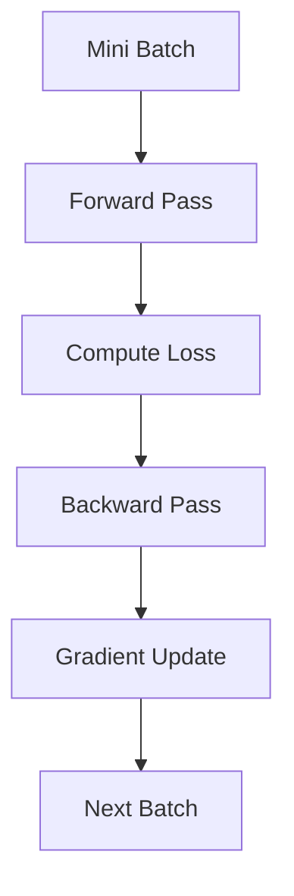
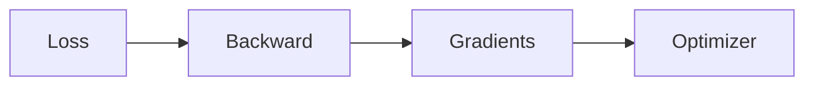
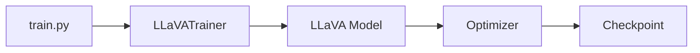

# LLaVA Trainer (`llava_trainer.py`)

## Introduction

The `llava_trainer.py` file implements the training engine used by LLaVA. It extends Hugging Face's `Trainer` class and customizes the training process for multimodal learning.

Instead of writing a training loop from scratch, LLaVA builds upon the robust training infrastructure provided by the Transformers library. This approach enables efficient optimization, distributed training, checkpoint management, and logging while allowing custom behavior where needed.

---

# Position in the Training Pipeline

```
train.py
    │
    ▼
LLaVATrainer
    │
    ├── Forward Pass
    ├── Compute Loss
    ├── Backpropagation
    ├── Optimizer Step
    ├── Save Checkpoints
    └── Logging
```

The trainer is responsible for executing every training iteration.

---

# Why Extend Hugging Face Trainer?

Instead of implementing a complete training framework, LLaVA inherits from:

```python
transformers.Trainer
```

This provides several built-in capabilities:

- Automatic optimization
- Learning rate scheduling
- Mixed precision training
- Distributed training
- Checkpoint management
- Evaluation support
- Logging

Only multimodal-specific behavior needs to be customized.

---

---

# Key Functions

`LLaVATrainer` extends Hugging Face's `Trainer` and customizes it for multimodal training.

| Function | Purpose |
|----------|---------|
| `create_optimizer()` | Creates the optimizer for model training |
| `create_scheduler()` | Initializes the learning rate scheduler |
| `_save_checkpoint()` | Saves intermediate checkpoints |
| `_save()` | Stores the final trained model |

These methods build upon Hugging Face's training framework while adding LLaVA-specific functionality.

---

# Training Loop

Every optimization step follows the same sequence.



The trainer repeats this process until all epochs have been completed.

---

# Forward Pass

During the forward pass:

```
Images

+

Text

        │
        ▼

LLaVA Model

        │
        ▼

Predicted Tokens

        │
        ▼

Loss
```

The trainer calls the model and receives the computed loss directly.

---

---

# Simplified Forward Step

The trainer delegates computation to the LLaVA model.

```python
outputs = model(

    input_ids=input_ids,

    images=images,

    labels=labels
)

loss = outputs.loss
```

### Explanation

1. Pass images and text to the model.
2. Compute predictions.
3. Calculate the training loss.
4. Return the loss for optimization.

The trainer itself does not compute predictions—it simply coordinates the optimization process.

---

# Backpropagation

Once the loss has been computed, gradients are calculated automatically.

### Simplified Implementation

```python
loss.backward()
```

Execution Flow:



The gradients indicate how every trainable parameter should be updated.

---

# Optimizer Step

After gradients are available, the optimizer updates the model parameters.

### Simplified Implementation

```python
optimizer.step()

optimizer.zero_grad()
```

The optimizer adjusts the weights, after which the accumulated gradients are cleared before the next iteration.

---

# Gradient Accumulation

Large multimodal models often exceed GPU memory limits.

Instead of increasing the batch size directly, LLaVA supports gradient accumulation.

```
Batch 1

↓

Gradients

+

Batch 2

↓

Gradients

+

Batch 3

↓

Optimizer Step
```

This simulates a larger effective batch size while using less memory.

---

# Mixed Precision Training

To improve efficiency, the trainer supports:

- FP16
- BF16

Advantages include:

- Reduced GPU memory usage
- Faster computation
- Larger effective batch sizes

Mixed precision has become standard practice for training large vision-language models.

---

# Distributed Training

For large-scale training across multiple GPUs, the trainer supports distributed execution.

```
Dataset

      │

 ┌────┴────┐

GPU 0   GPU 1

 │         │

 └────┬────┘

      ▼

Gradient Synchronization

      ▼

Updated Model
```

This enables efficient training on large datasets.

---

# Checkpoint Management

Training checkpoints are saved periodically to prevent loss of progress.

### Simplified Logic

```python
trainer.save_model(output_dir)
```

A checkpoint typically stores:

- Model weights
- Optimizer state
- Scheduler state
- Training progress

These checkpoints allow interrupted training sessions to resume from the last saved state.

---

# Logging

Throughout training, the trainer records metrics such as:

- Training loss
- Learning rate
- Epoch number
- Global training step

These logs help monitor convergence and identify potential training issues.

---

# Interaction with Other Files



---

---

# Code Flow

The trainer executes the following sequence during optimization:

```
trainer.train()

↓

Forward Pass

↓

Compute Loss

↓

loss.backward()

↓

optimizer.step()

↓

Save Checkpoint

↓

Next Iteration
```

The `LLaVATrainer` class manages the optimization loop while delegating the actual multimodal computation to the LLaVA model.

---


# Summary

The `llava_trainer.py` file extends Hugging Face's `Trainer` to support efficient multimodal training. It manages the complete optimization process, including forward and backward passes, gradient updates, checkpointing, distributed execution, and training metrics.

By building on the Transformers training framework, LLaVA avoids reinventing core training infrastructure while retaining the flexibility to support multimodal learning.

---

# Next

The next document explores `run_llava.py`, the primary inference script that loads a pretrained LLaVA model, processes user images and prompts, performs multimodal inference, and generates responses.