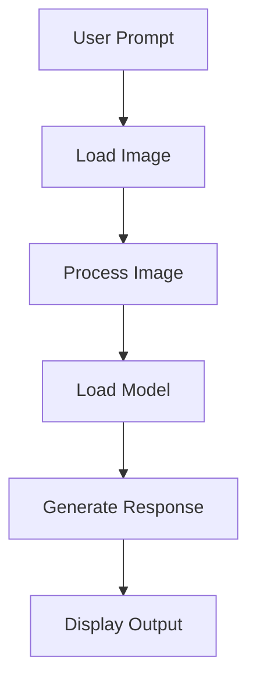
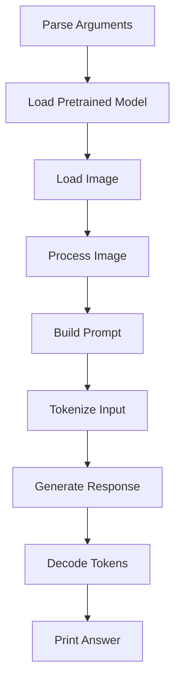
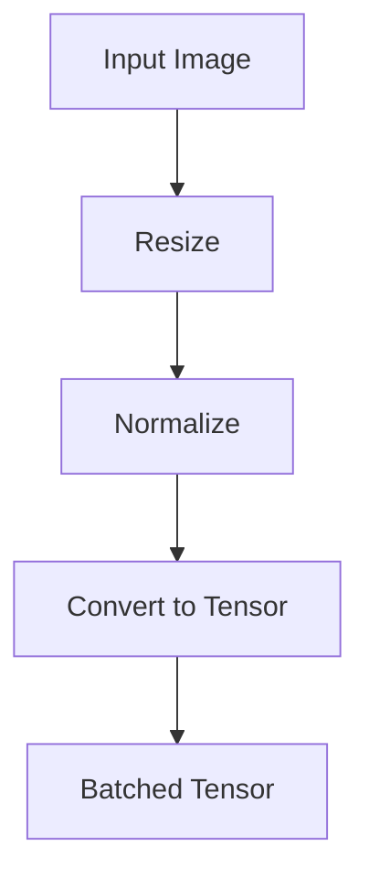
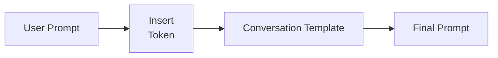
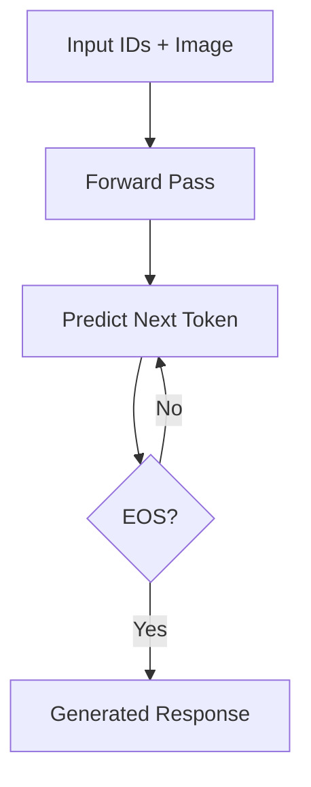
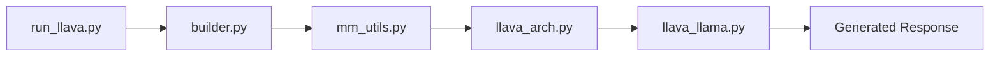
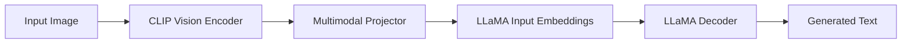

# Running LLaVA (`run_llava.py`)

## Introduction

The `run_llava.py` file is the primary inference script in the LLaVA repository. It demonstrates how a pretrained LLaVA model is loaded, how images and prompts are processed, and how the model generates responses.

Unlike the training pipeline, which focuses on optimizing model parameters, this script performs inference using a pretrained checkpoint.

For most users, `run_llava.py` serves as the main entry point for interacting with the model.

---

# Position in the Inference Pipeline



---

# Responsibilities

The main responsibilities of this file include:

- Parsing command-line arguments
- Loading the pretrained model
- Loading the tokenizer
- Loading the image processor
- Reading user images
- Formatting prompts
- Running inference
- Decoding generated tokens

---

# Key Functions

The `run_llava.py` script is the main entry point for inference. It loads the pretrained model, processes user inputs, and generates responses.

| Function | Purpose |
|----------|---------|
| `eval_model()` | Executes the complete inference pipeline |
| `load_pretrained_model()` | Loads the tokenizer, model, vision tower, and image processor |
| `process_images()` | Converts input images into tensors |
| `model.generate()` | Produces the final text response |

Together, these functions implement the complete multimodal inference workflow.

---

# Overall Workflow



---

# Simplified Inference Entry

The complete inference pipeline can be summarized as:

```python
tokenizer, model, image_processor, _ = load_pretrained_model(...)

image_tensor = process_images(...)

output_ids = model.generate(
    input_ids,
    images=image_tensor
)

response = tokenizer.decode(output_ids[0])
```

### Explanation

1. Load the pretrained LLaVA model.
2. Convert the input image into a tensor.
3. Generate output tokens.
4. Decode tokens into natural language.

> **Note:** The official implementation includes additional options for conversation templates, stopping criteria, and decoding parameters. The snippet above highlights the core inference workflow.

---

# Step 1: Parse Arguments

The script begins by reading user-provided arguments.

Typical arguments include:

- Model path
- Image path
- User prompt
- Conversation template
- Temperature
- Maximum generation length

This allows the same script to work with different checkpoints and images.

---

# Step 2: Load the Model

The script calls:

```python
load_pretrained_model(...)
```

This initializes:

```text
Tokenizer
      │
      ▼
Vision Tower
      │
      ▼
Multimodal Projector
      │
      ▼
LLaMA
```

Once loaded, the model is ready for inference.

---

# Step 3: Load the Image

The input image is read from disk.

```text
Image File
      │
      ▼
PIL Image
      │
      ▼
RGB Format
```

The image is then passed to the preprocessing pipeline.

---

# Step 4: Process the Image

The image processor converts the raw image into tensors.

### Simplified Implementation

```python
image_tensor = process_images(
    images,
    image_processor,
    model.config
)
```

### Execution Flow



The resulting tensor is compatible with the CLIP Vision Encoder.

---

# Step 5: Build the Prompt

The user prompt is combined with a conversation template before inference.

Example:

```text
<image>

Describe this image.
```

Execution Flow:



The `<image>` token marks where image embeddings will later be inserted into the language model.

---

# Step 6: Tokenization

The prompt is converted into token IDs while preserving the special `<image>` token.

```text
Prompt
      │
      ▼
Tokenizer
      │
      ▼
Input IDs
```

The image placeholder is later replaced with projected image embeddings inside `prepare_inputs_labels_for_multimodal()`.

---

# Step 7: Generate Response

The script calls:

```python
output_ids = model.generate(
    input_ids,
    images=image_tensor,
    max_new_tokens=512,
    temperature=0.2
)
```

### Execution Flow



The decoder repeatedly predicts one token at a time until an end-of-sequence token or the maximum generation length is reached.

---

# Step 8: Decode Output

The generated token IDs are converted back into natural language.

```text
Token IDs
      │
      ▼
Tokenizer Decode
      │
      ▼
Response Text
```

The decoded response is printed to the terminal or returned to the caller.

---

# Generation Parameters

The script exposes several generation parameters, including:

- `temperature`
- `top_p`
- `num_beams`
- `max_new_tokens`

These parameters allow users to control response diversity and generation length without modifying the model.

---

# Interaction with Other Files



The inference script coordinates all major components but delegates the actual multimodal computation to the underlying model.

---

# Code Flow

The complete execution order during inference is:

```text
run_llava.py

↓

load_pretrained_model()

↓

process_images()

↓

Conversation Template

↓

tokenizer_image_token()

↓

prepare_inputs_labels_for_multimodal()

↓

forward()

↓

generate()

↓

Decode Tokens

↓

Final Response
```

The `run_llava.py` script acts as the orchestrator of the complete inference pipeline by connecting image preprocessing, prompt construction, multimodal fusion, and autoregressive text generation.

---

# End-to-End Inference Pipeline



This diagram summarizes the complete inference pipeline implemented by LLaVA, from image input to the final generated response.

---

# Summary

The `run_llava.py` file is the primary inference entry point for LLaVA. It loads the pretrained model, preprocesses images, formats prompts, performs multimodal inference, and converts generated token IDs into human-readable responses.

By coordinating all major components—from image preprocessing to autoregressive text generation—it provides a simple yet powerful interface for evaluating LLaVA on image-text tasks.

---

# Next

The next document presents the complete end-to-end **training pipeline**, illustrating how data flows from the training dataset to the optimized multimodal model.